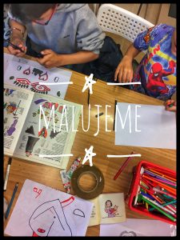
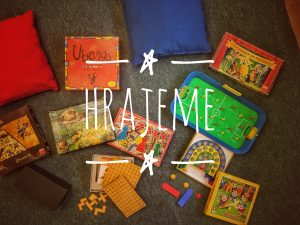
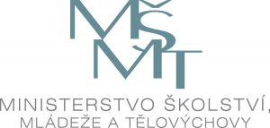

<!--StartFragment-->

Nudíš se po škole a nevíš co s volným časem? Přijď k nám na odpolední klub! :)

## Co děláme?

Volnočasový klub pro děti, které chtějí trávit svůj volný čas nějakou zajímavou aktivitou. Klub je otevřen všem dětem bez ohledu na věk a je zcela zdarma. Můžete se těšit na malování, sportování, vyrábění, deskové hry, povídání a spoustu dalšího.

#### Od dubna 2016 nabízíme v rámci projektu Animátor v Komunitním centru Hrubého bezplatné volnočasové aktivity a pro děti a mládež.

- #### Projekt probíhá za finanční podpory Ministerstva školství, mládeže a tělovýchovy.
- #### Jeho cílem je nabídnout dětem a mládeži, které tráví svůj volný čas na ulicích Prahy 8, smysluplný způsob trávení volného času.
- #### Pro děti jsou ve všední dny odpoledne připraveny bezplatné aktivity a kroužky: korálkování, malování, zahradničení, sportování, relaxační koutek, čtení knih, kreslení, zpěv, poslech hudby, modelování, povídání, výlety do okolí,

  

- #### deskové hry a další aktivity dle zájmu dětí.
- #### Program na následující týdny naleznete v kalendáři a na nástěnce u vchodu do KC Hrubého.
- #### Uvítáme jakýkoli nápad, podnět i připomínku, rádi naše aktivity uzpůsobíme vašim potřebám.
- #### Neváhejte a zastavte se u nás!

---

